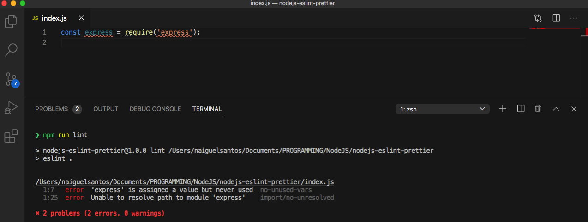

# NodeJS project with ESlint and Prettier dev dependences



```
npm install -D eslint prettier eslint-plugin-prettier eslint-config-prettier eslint-plugin-node eslint-config-node
```

## eslint-config-airbnb

```
npx install-peerdeps --dev eslint-config-airbnb
```

## .prettierrc

```
{
    "trailingComma": "es5",
    "tabWidth": 4,
    "semi": false,
    "singleQuote": true
}
```

## Install eslint globally

```
npm install -g eslint
```

## Init eslint config file

```
eslint --init
```

## Add script command in package.json file to run lint

```
"scripts": {
    "lint": "./node_modules/.bin/eslint ."
}
```

```
npm run lint
```
